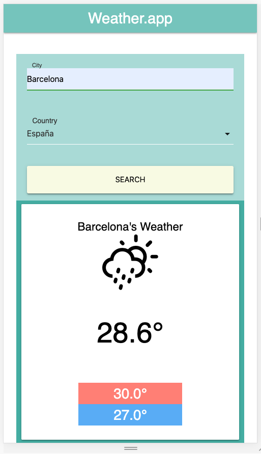

# WEATHER APP With React

## Description
Project with React.js about the Weather in various cities

## Demo


## Scripts
In the project directory, you can run:

### $ `yarn start`


## Technology Stack
- React.js
- Node.js
- Yarn
- Html
- Css
- Netlify.sh
- [Weather Library](https://erikflowers.github.io/weather-icons/)
- [Weather API](https://openweathermap.org/api)

## Install library ReactWeather Icons with yarn
```
$ yarn add react-weathericons
```

## Git repo
The url to repository and deployed project:

- [Repository Frontend Link](https://github.com/elenapiaggio/weather-app)
- [Deploy Link](https://react-app-the-weather.netlify.app/)

Made with :heart: by Elena Piaggio